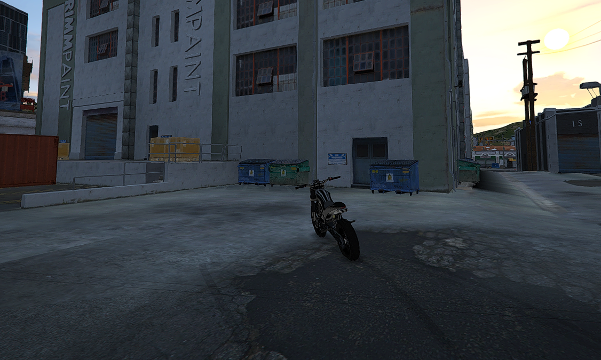

# 7. Uniforme Padrão

## Regra geral

O uniforme da Bennys deve ser seguido conforme o padrão abaixo.

> <mark style="color:$danger;">**NÃO USAR MÁSCARA**</mark>

## Uniforme feminino

### Obrigatório

* **Jaqueta:** 609
* **Camiseta:** 261 (Cinto)
* **Calça:** preta (na referência enviada, calça 231)

### Opcional

*   **Luvas pretas:** mãos 57\
     

    <figure><figcaption></figcaption></figure>

## Uniforme masculino

### Obrigatório

* **Jaqueta:** 654
* **Camiseta:** 218 (Cinto)
* **Calça:** preta

### Opcional

* **Luvas pretas**

<figure><figcaption></figcaption></figure>

## Observação importante

O uniforme serve para organização e para identificarmos quem está em serviço.
